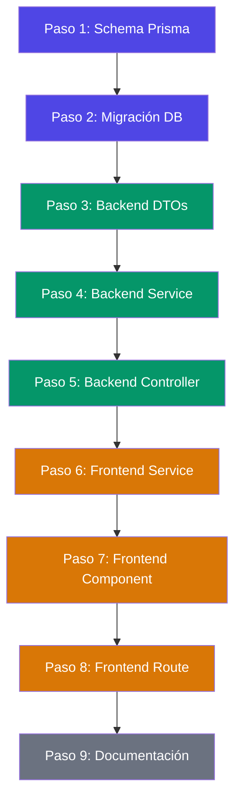
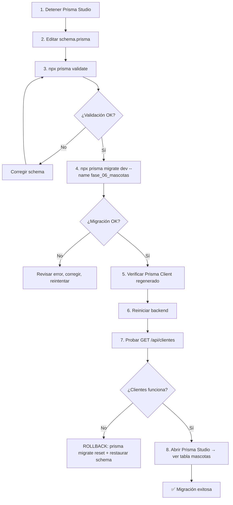

# Plan de Implementación — Fase 06: Gestión de Mascotas

Basado en el análisis técnico [fase-06-analisis.md](file:///c:/_Proyectos/vetexpert/docs/fase-06-analisis.md) y la arquitectura existente del proyecto.

---

## Dependencias entre capas



> [!IMPORTANT]
> Cada paso debe completarse y validarse antes de avanzar al siguiente. No saltar pasos.

---

## Paso 1 — Modificar Schema Prisma

### Archivos a tocar

| Archivo | Acción |
|---------|--------|
| [schema.prisma](file:///c:/_Proyectos/vetexpert/database/schema/schema.prisma) | Agregar modelo `Mascota` + relación `mascotas Mascota[]` en `Usuario` |

### Qué hacer exactamente

1. Agregar `mascotas Mascota[]` en el modelo `Usuario` (después de `recuperacionesClave`).
2. Agregar el modelo completo `Mascota` al final del archivo.
3. **NO** modificar ningún campo existente de `Usuario`.
4. **NO** modificar ningún otro modelo.

### Riesgos

| Riesgo | Probabilidad | Mitigación |
|--------|-------------|------------|
| Typo en nombre de campo rompe schema | Media | Validar con `npx prisma validate` antes de migrar |
| Relación apunta a campo incorrecto | Baja | La FK `clienteId` → `Usuario.id` es directa |
| Conflicto con Prisma Studio abierto | Alta | **Detener Prisma Studio antes de migrar** |

### Validación post-paso

```bash
npx prisma validate --schema=./database/schema/schema.prisma
```

- ✅ Debe pasar sin errores.
- ✅ No ejecutar migración todavía, solo validar syntax.

---

## Paso 2 — Migración de Base de Datos

### Pre-requisitos obligatorios

> [!CAUTION]
> Antes de migrar:
> 1. **Detener Prisma Studio** (ctrl+c en esa terminal).
> 2. **Verificar que backend y frontend compilan** sin errores.
> 3. Tener la DB accesible en localhost.

### Qué hacer exactamente

```bash
npx prisma migrate dev --name fase_06_mascotas --schema=./database/schema/schema.prisma
```

### Qué hace este comando internamente

1. Compara el schema actual vs la DB.
2. Genera SQL: `CREATE TABLE mascotas (...)`, `ALTER TABLE usuarios` (no altera, solo la relación Prisma).
3. Aplica la migración.
4. Regenera `@prisma/client`.

### Riesgos

| Riesgo | Probabilidad | Mitigación |
|--------|-------------|------------|
| Migración falla por DB bloqueada | Baja | Cerrar Prisma Studio y conexiones extras |
| Prisma Client no se regenera | Baja | Ejecutar `npx prisma generate` manualmente si falla |
| Tabla `mascotas` ya existe (manual previo) | Muy baja | Verificar con Prisma Studio antes |

### Validación post-paso

1. ✅ Migración aplicada sin errores.
2. ✅ Archivo de migración creado en `database/schema/migrations/`.
3. ✅ Abrir Prisma Studio de nuevo → tabla `mascotas` visible y vacía.
4. ✅ Backend reinicia sin errores (`npm run dev:backend`).
5. ✅ **Módulo clientes sigue funcionando** → hacer un `GET /api/clientes` de prueba.

---

## Paso 3 — Crear DTOs Backend

### Archivos a crear

| Archivo | Acción |
|---------|--------|
| `backend/src/mascotas/dto/crear-mascota.dto.ts` | **Nuevo** |
| `backend/src/mascotas/dto/actualizar-mascota.dto.ts` | **Nuevo** |
| `backend/src/mascotas/dto/listar-mascotas.dto.ts` | **Nuevo** |

### Dependencias

- Requiere que el Paso 2 esté completo (Prisma Client regenerado con el tipo `Mascota`).
- Los DTOs usan `class-validator` y `class-transformer` (ya instalados).

### Patrón a seguir

Replicar exactamente el patrón de los DTOs de clientes:
- [crear-cliente.dto.ts](file:///c:/_Proyectos/vetexpert/backend/src/clientes/dto/crear-cliente.dto.ts) → `crear-mascota.dto.ts`
- [actualizar-cliente.dto.ts](file:///c:/_Proyectos/vetexpert/backend/src/clientes/dto/actualizar-cliente.dto.ts) → `actualizar-mascota.dto.ts`
- [listar-clientes.dto.ts](file:///c:/_Proyectos/vetexpert/backend/src/clientes/dto/listar-clientes.dto.ts) → `listar-mascotas.dto.ts`

### Riesgos

| Riesgo | Probabilidad | Mitigación |
|--------|-------------|------------|
| Decoradores mal importados | Baja | Seguir imports exactos de clientes |
| Validaciones con valores incorrectos | Baja | Revisar tabla de validaciones del análisis |

### Validación post-paso

- ✅ Backend compila sin errores TypeScript.
- ✅ Los DTOs no se importan aún en ningún sitio (no afectan nada).
- ✅ **Clientes sigue funcionando** (no se tocó nada de clientes).

---

## Paso 4 — Implementar Service Backend

### Archivos a modificar

| Archivo | Acción |
|---------|--------|
| [mascotas.service.ts](file:///c:/_Proyectos/vetexpert/backend/src/mascotas/mascotas.service.ts) | **Reemplazar** stub con CRUD completo |

### Dependencias

- Requiere Paso 2 (modelo Prisma) y Paso 3 (DTOs).
- Usa `PrismaService` existente (ya inyectado globalmente via `PrismaModule`).

### Patrón a seguir

Replicar el patrón de [clientes.service.ts](file:///c:/_Proyectos/vetexpert/backend/src/clientes/clientes.service.ts):

| Método clientes | Método mascotas equivalente |
|-----------------|---------------------------|
| `listar(query)` | `listar(query)` — con filtros especie + clienteId adicionales |
| `obtenerPorId(id)` | `obtenerPorId(id)` — incluye `cliente` en select |
| `crear(dto)` | `crear(dto)` — valida clienteId existe |
| `actualizar(id, dto)` | `actualizar(id, dto)` |
| `eliminar(id)` | `eliminar(id)` — soft delete |
| `validarDuplicados()` | `validarCliente(clienteId)` — valida que el cliente exista |
| `camposCliente()` | `camposMascota()` — con include cliente |

### Diferencias clave vs clientes

1. **No hay hash de password** (mascotas no tienen login).
2. **Se incluye relación `cliente`** en las respuestas con `select` anidado.
3. **Validación de clienteId**: verificar que el UUID corresponde a un Usuario activo tipo CLIENTE.
4. **Filtro adicional por especie** en el método `listar`.
5. **Búsqueda expandida**: buscar en nombre mascota, raza, y nombre/DNI del cliente.

### Riesgos

| Riesgo | Probabilidad | Mitigación |
|--------|-------------|------------|
| Query Prisma con include/select anidado mal formado | Media | Testar con Prisma Studio + logs |
| `clienteId` inválido pasa sin validar | Media | Validar explícitamente en service antes de create |
| Búsqueda en relación cliente causa error Prisma | Baja | Usar `cliente: { is: { OR: [...] } }` correctamente |

### Validación post-paso

- ✅ Backend compila sin errores.
- ✅ El service no se expone aún a HTTP (el controller sigue siendo stub).
- ✅ **Clientes sigue funcionando** (archivos de clientes no tocados).

---

## Paso 5 — Implementar Controller Backend

### Archivos a modificar

| Archivo | Acción |
|---------|--------|
| [mascotas.controller.ts](file:///c:/_Proyectos/vetexpert/backend/src/mascotas/mascotas.controller.ts) | **Reemplazar** stub con CRUD endpoints |

### Dependencias

- Requiere Paso 4 (service implementado).
- Reutiliza guards y decorators existentes:
  - [jwt-auth.guard.ts](file:///c:/_Proyectos/vetexpert/backend/src/common/guards/jwt-auth.guard.ts)
  - [roles.guard.ts](file:///c:/_Proyectos/vetexpert/backend/src/common/guards/roles.guard.ts)
  - `@Roles()` decorator

### Patrón a seguir

Replicar [clientes.controller.ts](file:///c:/_Proyectos/vetexpert/backend/src/clientes/clientes.controller.ts) con estas diferencias:

| Aspecto | Clientes | Mascotas |
|---------|----------|----------|
| Guard global | `@Roles(ADMIN, SECRETARIA)` | Diferenciado por endpoint |
| GET/GET:id | ADMIN, SECRETARIA | ADMIN, SECRETARIA, **VETERINARIO** |
| POST | ADMIN, SECRETARIA | ADMIN, SECRETARIA |
| PATCH | ADMIN, SECRETARIA | ADMIN, SECRETARIA, **VETERINARIO** |
| DELETE | ADMIN, SECRETARIA | ADMIN, SECRETARIA |

### Riesgos

| Riesgo | Probabilidad | Mitigación |
|--------|-------------|------------|
| Guard mal configurado permite acceso no autorizado | Media | Testar cada endpoint con token de cada rol |
| Ruta `/api/mascotas` colisiona con stub `/api/mascotas/estado` | Baja | El stub se elimina al reemplazar el controller |
| `MascotasModule` no importa `PrismaModule` | Baja | `PrismaModule` es global, no necesita import explícito |

### Validación post-paso

> [!IMPORTANT]
> Esta es la primera validación E2E del backend de mascotas.

1. ✅ Backend compila y reinicia sin errores.
2. ✅ Probar con herramienta HTTP (Insomnia/Postman/curl):
   - `POST /api/auth/staff/login` → obtener token admin.
   - `POST /api/clientes` → crear un cliente de prueba (si no hay uno).
   - `POST /api/mascotas` → crear mascota con `clienteId` del cliente.
   - `GET /api/mascotas` → ver mascota en listado.
   - `GET /api/mascotas/:id` → ver detalle con datos del cliente.
   - `PATCH /api/mascotas/:id` → actualizar nombre.
   - `DELETE /api/mascotas/:id` → soft delete.
3. ✅ Probar guards: request sin token debe dar 401.
4. ✅ **Clientes sigue funcionando**: `GET /api/clientes` responde correctamente.
5. ✅ **Auth sigue funcionando**: login y refresh siguen operando.

---

## Paso 6 — Crear Service Frontend

### Archivos a crear

| Archivo | Acción |
|---------|--------|
| `frontend/src/services/mascotas.ts` | **Nuevo** |

### Dependencias

- Requiere Paso 5 (endpoints backend funcionando).
- Usa la instancia `api` de [api.ts](file:///c:/_Proyectos/vetexpert/frontend/src/services/api.ts) (ya existente).

### Patrón a seguir

Replicar exactamente [clientes.ts](file:///c:/_Proyectos/vetexpert/frontend/src/services/clientes.ts):
- Tipos TypeScript para `Mascota`, `MascotasMeta`, `MascotasQuery`, `MascotaPayload`.
- 5 funciones: `listarMascotas`, `obtenerMascota`, `crearMascota`, `actualizarMascota`, `eliminarMascota`.

### Riesgos

| Riesgo | Probabilidad | Mitigación |
|--------|-------------|------------|
| Tipos no coinciden con respuesta backend | Media | Validar tipos contra respuesta real del backend |
| Import del api instance falla | Muy baja | Mismo import que clientes.ts |

### Validación post-paso

- ✅ Frontend compila sin errores TypeScript.
- ✅ El service no se usa aún en ningún componente.
- ✅ **Dashboard clientes sigue funcionando**.

---

## Paso 7 — Crear Componente MascotasPage

### Archivos a crear

| Archivo | Acción |
|---------|--------|
| `frontend/src/modules/mascotas/components/MascotasPage.tsx` | **Nuevo** |

### Dependencias

- Requiere Paso 6 (service frontend).
- Reutiliza componentes UI existentes:
  - [Button.tsx](file:///c:/_Proyectos/vetexpert/frontend/src/components/ui/Button.tsx)
  - [Input.tsx](file:///c:/_Proyectos/vetexpert/frontend/src/components/ui/Input.tsx)
  - [Skeleton.tsx](file:///c:/_Proyectos/vetexpert/frontend/src/components/ui/Skeleton.tsx)
- Reutiliza [utils.ts](file:///c:/_Proyectos/vetexpert/frontend/src/lib/utils.ts) (`cn` function).
- Usa librerías ya instaladas: `framer-motion`, `lucide-react`, `zod`.
- Necesita acceso a `listarClientes` de [clientes.ts](file:///c:/_Proyectos/vetexpert/frontend/src/services/clientes.ts) para el selector de dueño.

### Patrón a seguir

Replicar la estructura de [ClientesPage.tsx](file:///c:/_Proyectos/vetexpert/frontend/src/modules/clientes/components/ClientesPage.tsx) (485 líneas) adaptada a mascotas:

- Componentes internos en el mismo archivo.
- Estado local con `useState` (sin store global).
- Carga con `useEffect` + debounce.
- Modal con Framer Motion.
- Drawer de detalle lateral.
- Toast notifications.

### Diferencias principales vs ClientesPage

1. **Más campos en el formulario** (especie, raza, sexo, peso, color, esterilizado, alergias, observaciones, fechaNacimiento).
2. **Selector de cliente** (requiere cargar lista de clientes).
3. **Filtro adicional por especie** (select extra en la barra de filtros).
4. **Emojis por especie** en tabla y detalle.
5. **Datos del dueño** visibles en tabla y detalle.

### Riesgos

| Riesgo | Probabilidad | Mitigación |
|--------|-------------|------------|
| Formulario demasiado largo en mobile | Media | Grid 2 cols desktop + scroll en modal |
| Carga de clientes para selector falla silenciosamente | Media | Manejar error con toast + deshabilitar submit |
| Validación Zod no coincide con backend | Baja | Usar mismas reglas que los DTOs backend |
| Dark mode no aplica a nuevos estilos | Baja | Usar tokens CSS existentes (`texto`, `superficie`, etc.) |

### Validación post-paso

- ✅ Frontend compila sin errores.
- ✅ El componente no se renderiza aún (no está conectado a la ruta).
- ✅ **Dashboard clientes sigue funcionando**.

---

## Paso 8 — Conectar Ruta Frontend

### Archivos a modificar

| Archivo | Acción |
|---------|--------|
| [page.tsx](file:///c:/_Proyectos/vetexpert/frontend/src/app/dashboard/mascotas/page.tsx) | **Modificar** — reemplazar `PlaceholderPanel` con `MascotasPage` |

### Dependencias

- Requiere Paso 7 (componente creado).

### Qué hacer exactamente

Cambiar:
```tsx
import { PlaceholderPanel } from "@/modules/dashboard/components/PlaceholderPanel";
// → PlaceholderPanel
```

Por:
```tsx
import { MascotasPage } from "@/modules/mascotas/components/MascotasPage";
// → MascotasPage
```

### Riesgos

| Riesgo | Probabilidad | Mitigación |
|--------|-------------|------------|
| Import path incorrecto | Muy baja | Verificar que el archivo existe en la ruta esperada |
| La ruta deja de funcionar | Muy baja | Solo cambia el contenido, no la estructura de ruta |

### Validación post-paso — TEST E2E COMPLETO

> [!IMPORTANT]
> Esta es la validación final de toda la Fase 06. Testear exhaustivamente.

**Flujo completo a verificar:**

1. ✅ Navegar a `/dashboard/mascotas` → tabla vacía con mensaje "Sin mascotas".
2. ✅ Click "Nueva mascota" → modal abre con formulario.
3. ✅ Selector de cliente muestra clientes activos.
4. ✅ Validación frontend: enviar formulario vacío → errores de validación visibles.
5. ✅ Crear mascota con datos válidos → toast "Mascota creada." + tabla actualizada.
6. ✅ Buscar mascota por nombre → filtro funciona.
7. ✅ Filtrar por especie → filtro funciona.
8. ✅ Filtrar por estado → activos/inactivos/todos funciona.
9. ✅ Click icono ver → drawer de detalle abre con todos los datos + datos del dueño.
10. ✅ Click icono editar → modal con datos precargados.
11. ✅ Editar mascota → toast "Mascota actualizada." + tabla actualizada.
12. ✅ Click icono eliminar → confirmación + toast "Mascota eliminada correctamente."
13. ✅ Paginación funciona (crear 11+ mascotas para probar).
14. ✅ Dark mode → todo se ve correctamente.
15. ✅ Mobile responsive → cards en vez de tabla.

**Módulos existentes (NO DEBEN ROMPERSE):**

16. ✅ `/dashboard/clientes` sigue funcionando completamente.
17. ✅ Login/logout sigue funcionando.
18. ✅ Landing page sigue funcionando.
19. ✅ Sidebar muestra enlace a mascotas correctamente.

---

## Paso 9 — Actualizar Documentación

### Archivos a modificar

| Archivo | Acción |
|---------|--------|
| [endpoints.md](file:///c:/_Proyectos/vetexpert/docs/endpoints.md) | Reemplazar "Pendiente implementación" con endpoints reales |
| [progreso_actual.md](file:///c:/_Proyectos/vetexpert/memory/progreso_actual.md) | Agregar sección Fase 06 + actualizar roadmap |

### Riesgos

Ninguno. Solo documentación.

### Validación post-paso

- ✅ Documentación refleja el estado real del sistema.

---

## Análisis Global de Riesgos

### Riesgos que podrían romper módulos existentes

| # | Riesgo | Módulo afectado | Probabilidad | Impacto | Mitigación |
|---|--------|----------------|-------------|---------|------------|
| 1 | Migración Prisma modifica tabla `usuarios` | Auth + Clientes | **Muy baja** | Alto | La migración solo agrega columna de relación en Prisma, la tabla SQL no cambia |
| 2 | Regenerar Prisma Client rompe tipos existentes | Todo el backend | **Muy baja** | Alto | El modelo `Usuario` no cambia campos, solo agrega relación `mascotas[]` |
| 3 | Nuevo módulo importa algo incorrecto de `common/` | Auth | **Muy baja** | Medio | Solo reutilizamos guards y decorators ya probados |
| 4 | Ruta `/api/mascotas` colisiona con otra ruta | Backend | **Nula** | Medio | No existe otra ruta con ese prefijo |
| 5 | Modificar `page.tsx` de mascotas rompe navegación | Dashboard | **Muy baja** | Bajo | Solo cambia contenido interno de la página |
| 6 | Error en MascotasPage afecta renderizado del dashboard | Dashboard layout | **Muy baja** | Bajo | El componente está aislado en su propia ruta |

### Análisis: ¿Por qué esta fase es de bajo riesgo?

1. **Es un módulo nuevo**: no modifica código existente, solo agrega.
2. **El schema Prisma solo agrega**: modelo nuevo + una relación en `Usuario` (no modifica campos existentes).
3. **El módulo backend ya existe como stub**: `MascotasModule` ya está importado en `AppModule`.
4. **La ruta frontend ya existe**: `/dashboard/mascotas` ya está en el router con placeholder.
5. **No se tocan dependencias**: no se instalan ni actualizan paquetes.

---

## Estrategia Segura de Migración Prisma



> [!WARNING]
> Si la migración falla o rompe clientes, el rollback es:
> ```bash
> git checkout -- database/schema/schema.prisma
> npx prisma migrate reset --schema=./database/schema/schema.prisma
> npx prisma db push --schema=./database/schema/schema.prisma
> ```
> Esto restaura la DB al estado anterior. Se pierden datos de desarrollo (no importa en localhost).

---

## Orden de Commits Sugerido

| # | Commit | Archivos |
|---|--------|----------|
| 1 | `feat(prisma): modelo mascota con relacion cliente` | `schema.prisma` + migración |
| 2 | `feat(backend): dtos modulo mascotas` | 3 archivos DTO |
| 3 | `feat(backend): service mascotas con crud completo` | `mascotas.service.ts` |
| 4 | `feat(backend): controller mascotas con endpoints protegidos` | `mascotas.controller.ts` |
| 5 | `feat(frontend): service y componente mascotas` | `mascotas.ts` + `MascotasPage.tsx` + `page.tsx` |
| 6 | `docs: actualizar endpoints y progreso fase 06` | `endpoints.md` + `progreso_actual.md` |

---

## Checklist Técnico Final

### Prisma & DB
- [ ] Modelo `Mascota` creado en schema.
- [ ] Relación `mascotas Mascota[]` en `Usuario`.
- [ ] Migración aplicada sin errores.
- [ ] Tabla `mascotas` visible en Prisma Studio.
- [ ] Prisma Client regenerado correctamente.

### Backend
- [ ] DTOs creados: crear, actualizar, listar.
- [ ] Service con CRUD completo: listar, obtenerPorId, crear, actualizar, eliminar.
- [ ] Validación de `clienteId` en service (cliente activo, tipo CLIENTE).
- [ ] Controller con 5 endpoints protegidos.
- [ ] Guards JWT funcionando en todos los endpoints.
- [ ] Roles diferenciados: VETERINARIO puede ver/editar pero no crear/eliminar.
- [ ] Soft delete funcionando (marca `eliminadoEn` + `activo: false`).
- [ ] Paginación, búsqueda y filtros funcionando.
- [ ] Respuestas incluyen datos básicos del cliente.

### Frontend
- [ ] Service con tipos y funciones API.
- [ ] Componente `MascotasPage` con tabla, modal, drawer, toast.
- [ ] Selector de cliente funcional en modal.
- [ ] Validación Zod en formulario.
- [ ] Filtros por estado y especie.
- [ ] Ruta `/dashboard/mascotas` conectada.

### Integridad del sistema
- [ ] Auth funciona (login, refresh, logout).
- [ ] Clientes funciona (CRUD completo).
- [ ] Landing funciona.
- [ ] Dark mode funciona en mascotas.
- [ ] Responsive funciona en mascotas.
- [ ] Backend compila sin errores TypeScript.
- [ ] Frontend compila sin errores TypeScript.
