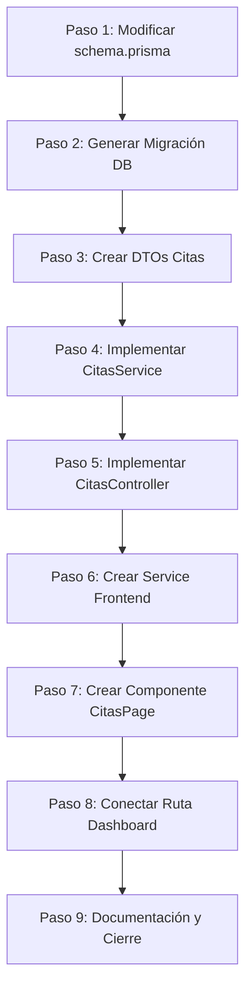

# Fase 07 — Análisis Técnico: Gestión de Citas

Este documento detalla la planificación técnica del módulo de citas para VetExpert. Sigue los patrones arquitectónicos estables y las decisiones de diseño del proyecto (Clean Architecture, monolito modular, TypeScript estricto, Prisma ORM y Next.js App Router).

---

## 1. Diseño de la Base de Datos (Prisma)

Para dar soporte a las citas, es necesario crear la entidad `Cita` y actualizar los modelos `Usuario` (dueños y veterinarios) y `Mascota` en `database/schema/schema.prisma`.

### Nuevo Enum: `EstadoCita`
```prisma
enum EstadoCita {
  PENDIENTE
  CONFIRMADA
  COMPLETADA
  CANCELADA
}
```

### Nuevo Modelo: `Cita`
```prisma
model Cita {
  id              String      @id @default(uuid()) @db.Uuid
  fecha           DateTime    @map("fecha")
  motivo          String      @map("motivo")
  observaciones   String?     @map("observaciones")
  estado          EstadoCita  @default(PENDIENTE) @map("estado")
  mascotaId       String      @map("mascota_id") @db.Uuid
  veterinarioId   String      @map("veterinario_id") @db.Uuid
  clienteId       String      @map("cliente_id") @db.Uuid
  creadoEn        DateTime    @default(now()) @map("creado_en")
  actualizadoEn   DateTime    @updatedAt @map("actualizado_en")
  eliminadoEn     DateTime?   @map("eliminado_en")

  mascota         Mascota     @relation(fields: [mascotaId], references: [id], onDelete: Restrict)
  veterinario     Usuario     @relation("CitasComoVeterinario", fields: [veterinarioId], references: [id], onDelete: Restrict)
  cliente         Usuario     @relation("CitasComoCliente", fields: [clienteId], references: [id], onDelete: Restrict)

  @@index([mascotaId])
  @@index([veterinarioId])
  @@index([clienteId])
  @@map("citas")
}
```

### Modificaciones en Relaciones Existentes

#### 1. En `Usuario` (`Usuario` tiene doble relación 1:N con `Cita`):
```prisma
model Usuario {
  // ... campos existentes ...
  citasComoVeterinario Cita[] @relation("CitasComoVeterinario")
  citasComoCliente     Cita[] @relation("CitasComoCliente")

  @@map("usuarios")
}
```

#### 2. En `Mascota` (`Mascota` tiene relación 1:N con `Cita`):
```prisma
model Mascota {
  // ... campos existentes ...
  citas                Cita[]

  @@map("mascotas")
}
```

### Justificación de Restricciones (`onDelete: Restrict`)
- No se permite eliminar un usuario (Veterinario/Cliente) ni una mascota si tienen citas agendadas, para proteger el historial médico y de facturación del sistema.

---

## 2. Estructura Backend

Se creará la siguiente estructura modular dentro de `backend/src/citas/`:
```
backend/src/citas/
├── citas.controller.ts
├── citas.module.ts
├── citas.service.ts
└── dto/
    ├── crear-cita.dto.ts
    ├── actualizar-cita.dto.ts
    └── listar-citas.dto.ts
```

---

## 3. Endpoints REST

| Método | Ruta | Descripción | Roles Permitidos |
|--------|------|-------------|------------------|
| `GET` | `/api/citas` | Listar citas con filtros, búsqueda y paginación | ADMIN, SECRETARIA, VETERINARIO |
| `GET` | `/api/citas/:id` | Obtener detalle de cita individual | ADMIN, SECRETARIA, VETERINARIO |
| `POST` | `/api/citas` | Agendar nueva cita | ADMIN, SECRETARIA |
| `PATCH` | `/api/citas/:id` | Modificar datos de cita / cambiar estado | ADMIN, SECRETARIA, VETERINARIO |
| `DELETE` | `/api/citas/:id` | Soft delete de una cita | ADMIN, SECRETARIA |

### Seguridad y Control por Roles
- **VETERINARIO**: Puede ver listados (filtrados por defecto a su agenda personal) y actualizar observaciones/estados (`COMPLETADA` / `CANCELADA`), pero no crear ni eliminar citas.
- **ADMIN / SECRETARIA**: Control administrativo completo (crear, modificar y eliminar).

---

## 4. DTOs del Backend

### A. `crear-cita.dto.ts`
```typescript
import { IsDateString, IsEnum, IsOptional, IsString, IsUUID, MaxLength, MinLength } from "class-validator";
import { EstadoCita } from "@prisma/client";

export class CrearCitaDto {
  @IsDateString({}, { message: "La fecha de la cita no es valida." })
  fecha!: string;

  @IsString({ message: "El motivo es obligatorio." })
  @MinLength(3, { message: "El motivo debe tener al menos 3 caracteres." })
  @MaxLength(200, { message: "El motivo no debe superar los 200 caracteres." })
  motivo!: string;

  @IsOptional()
  @IsString({ message: "Las observaciones no son validas." })
  @MaxLength(1000, { message: "Las observaciones no deben superar los 1000 caracteres." })
  observaciones?: string;

  @IsOptional()
  @IsEnum(EstadoCita, { message: "El estado de la cita no es valido." })
  estado?: EstadoCita;

  @IsUUID("4", { message: "La mascota seleccionada no es valida." })
  mascotaId!: string;

  @IsUUID("4", { message: "El veterinario seleccionado no es valido." })
  veterinarioId!: string;
}
```

### B. `actualizar-cita.dto.ts`
Todos los campos de `CrearCitaDto` como opcionales (`@IsOptional()`).

### C. `listar-citas.dto.ts`
```typescript
import { Type } from "class-transformer";
import { IsEnum, IsInt, IsOptional, IsString, IsUUID, Max, Min } from "class-validator";
import { EstadoCita } from "@prisma/client";

export class ListarCitasDto {
  @IsOptional()
  @Type(() => Number)
  @IsInt()
  @Min(1)
  pagina?: number = 1;

  @IsOptional()
  @Type(() => Number)
  @IsInt()
  @Min(1)
  @Max(50)
  limite?: number = 10;

  @IsOptional()
  @IsString()
  busqueda?: string;

  @IsOptional()
  @IsEnum(EstadoCita, { message: "El filtro de estado no es valido." })
  estado?: EstadoCita;

  @IsOptional()
  @IsUUID("4")
  veterinarioId?: string;

  @IsOptional()
  @IsUUID("4")
  clienteId?: string;

  @IsOptional()
  @IsUUID("4")
  mascotaId?: string;

  @IsOptional()
  @IsString()
  fechaInicio?: string;

  @IsOptional()
  @IsString()
  fechaFin?: string;
}
```

---

## 5. Validaciones de Negocio (Service)

1. **Fecha no en el Pasado**: Al crear una cita, la propiedad `fecha` debe ser posterior o igual a la hora actual.
2. **Existencia de Entidades**:
   - `mascotaId` debe ser una mascota activa (`activo: true`, `eliminadoEn: null`).
   - `veterinarioId` debe corresponder a un usuario activo con `rol: VETERINARIO` y `tipoUsuario: STAFF`.
3. **Asociación de Cliente Automática**:
   - En lugar de pedir `clienteId` en el payload de creación, el servicio extraerá `clienteId` directamente de la propiedad `clienteId` de la Mascota asociada para prevenir errores o fraudes de registros cruzados.
4. **Validación de Cruce de Horarios (Evitar Double-Booking)**:
   - Se validará que un veterinario no tenga más de una cita agendada a la misma hora exacta (tolerancia configurable de 15/30 minutos si se requiere en el futuro, validación inicial por coincidencia exacta).

---

## 6. Estructura Frontend

Se crearán los siguientes archivos en Next.js:
```
frontend/src/
├── services/
│   └── citas.ts
├── modules/
│   └── citas/
│       └── components/
│           └── CitasPage.tsx
```

### Tipos en `services/citas.ts`:
```typescript
import { type Mascota } from "./mascotas";
import { type Cliente } from "./clientes";

export type Cita = {
  id: string;
  fecha: string;
  motivo: string;
  observaciones: string | null;
  estado: "PENDIETNE" | "CONFIRMADA" | "COMPLETADA" | "CANCELADA";
  mascotaId: string;
  veterinarioId: string;
  clienteId: string;
  mascota: {
    id: string;
    nombre: string;
    especie: string;
  };
  veterinario: {
    id: string;
    nombres: string;
    apellidos: string;
  };
  cliente: {
    id: string;
    nombres: string;
    apellidos: string;
    celular: string | null;
  };
  creadoEn: string;
  actualizadoEn: string;
};
```

---

## 7. Diseño UX/UI (CitasPage)

El diseño replicará la estética moderna, limpia y compatible con Dark Mode del dashboard:

- **Evolución del Filtro**: Barra superior con búsqueda de texto libre, filtro por Estado de cita, selector rápido de Veterinario (para secretarias) y rango de fechas.
- **Tabla Desktop**: Columnas con:
  - **Fecha y Hora**: Formato legible y ordenado.
  - **Paciente**: Emojis por especie + Nombre mascota.
  - **Dueño**: Nombre completo del dueño + Celular.
  - **Veterinario**: Nombre completo del profesional asignado.
  - **Estado**: Badge con color específico (Amarillo: Pendiente, Azul: Confirmada, Verde: Completada, Rojo: Cancelada).
  - **Acciones**: Drawer lateral de detalle, Edición y Cancelación/Eliminación.
- **Modal de Formulario (Citas)**:
  - Selector interactivo de **Dueño/Cliente** (búsqueda y precarga).
  - Selector de **Mascota**: Se habilita y filtra automáticamente para mostrar **únicamente** las mascotas del dueño seleccionado.
  - Selector de **Veterinario**: Desplegable que precarga la lista del personal con rol `VETERINARIO`.
  - Campo de fecha y hora local.
- **Drawer de Detalle**: Slide-in derecho con cronología detallada, estado actual de la cita y campo extendido para observaciones y pre-diagnóstico médico.

---

## 8. Plan de Implementación Detallado (Fase 07)

El desarrollo se segmenta en pasos incrementales y seguros:



### Paso 1: Schema Prisma
- Modificar `database/schema/schema.prisma` para incluir el enum `EstadoCita` y la tabla `Cita`.
- Añadir relaciones inversas en `Usuario` y `Mascota`.
- Validar esquema usando `npx prisma validate`.

### Paso 2: Migración
- Ejecutar `npx prisma migrate dev --name fase_07_citas`.
- Confirmar la creación de tipos en `@prisma/client`.

### Paso 3: DTOs Backend
- Crear los tres DTOs del backend (`CrearCitaDto`, `ActualizarCitaDto`, `ListarCitasDto`).
- Validar tipos con `npm run typecheck --workspace backend`.

### Paso 4: Servicio Backend
- Codificar la lógica CRUD en `citas.service.ts`.
- Añadir validaciones de fechas no futuras/pasadas y verificación referencial.

### Paso 5: Controlador Backend
- Crear endpoints en `citas.controller.ts`.
- Asociar los DTOs y asignar guards por rol (` JwtAuthGuard`, `RolesGuard`, `@Roles()`).
- Pruebas manuales HTTP locales.

### Paso 6: Service Frontend
- Desarrollar `frontend/src/services/citas.ts` conteniendo los tipos TypeScript y los métodos Axios correspondientes.

### Paso 7: Vista Frontend
- Desarrollar el componente completo `frontend/src/modules/citas/components/CitasPage.tsx` con listados, buscador, filtros, modal, drawer y toasts.
- Consumir endpoints de listado de veterinarios (`/api/usuarios/veterinarios` o similar, o filtrar localmente los usuarios cargados) y mascotas del cliente.

### Paso 8: Conectar Ruta
- Reemplazar el panel temporal (`PlaceholderPanel`) de la ruta `frontend/src/app/dashboard/citas/page.tsx` por el componente `<CitasPage />`.
- Probar flujos visuales completos.

### Paso 9: Cierre y Documentación
- Actualizar `docs/endpoints.md` y `memory/progreso_actual.md`.

---

## 9. Checklist Técnico Final

### Base de Datos
- [ ] Enum `EstadoCita` implementado.
- [ ] Modelo `Cita` agregado con relaciones directas e índices.
- [ ] Migración de base de datos exitosa.

### Backend
- [ ] DTOs de citas creados y validados.
- [ ] Validación de fecha futura y existencia de mascota/veterinario implementada.
- [ ] Asociación automática del `clienteId` basada en la mascota elegida.
- [ ] Endpoints protegidos por roles mediante guards.
- [ ] Compilación exitosa del backend.

### Frontend
- [ ] Service de citas implementado.
- [ ] Componente `CitasPage` responsive y compatible con modo oscuro.
- [ ] Selector interactivo dependiente: Mascota se filtra al elegir al Dueño.
- [ ] Drawer lateral con detalles médicos y datos del dueño visible.
- [ ] Conexión a la ruta protegida `/dashboard/citas`.
- [ ] Compilación exitosa del frontend.
